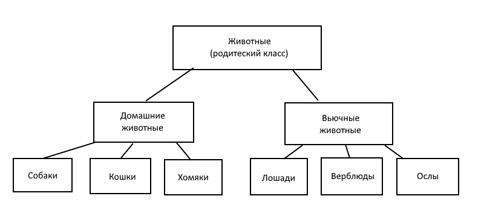

Вижу 3 варианта итогового задания. Использую [это](https://gbcdn.mrgcdn.ru/uploads/asset/4868005/attachment/1f0bfdadc1c954fc748a4890b644e605.pdf)...

Команды для заданий 1-2:
```
cat > "Домашние животные"
cat > "Вьючные животные"
cat "Домашние животные" "Вьючные животные" > 2in1
cat 2in1
mv 2in1 "Друзья человека"
mkdir Директория
mv "Друзья человека" Директория/
```

Команды для задания 3:
```
wget https://dev.mysql.com/get/mysql-apt-config_0.8.24-1_all.deb
sudo dpkg -i Загрузки/mysql-apt-config_0.8.24-1_all.deb
sudo apt-get update
sudo apt-get install mysql-server -y
```

Команды для задания 4:
```
wget https://dev.mysql.com/get/Downloads/Connector-J/mysql-connector-j_8.0.32-1ubuntu22.04_all.deb
sudo dpkg -i mysql-connector-j_8.0.32-1ubuntu22.04_all.deb
sudo dpkg -r mysql-connector-j
```
Задание 5 - выполнено путём перечисления команд из терминала Ubuntu, необходимых для выполнения задания 1-4

Задание 6 - как понял, так и выполнил. Надеюсь, имелось ввиду именно это:


Запросы для выполнения задания 7-9:
```
CREATE DATABASE people_friends;
USE people_friends;
CREATE TABLE cats LIKE dogs;
CREATE TABLE hamsters LIKE dogs;
CREATE TABLE horses LIKE dogs;
CREATE TABLE camels LIKE dogs;
CREATE TABLE donkeys LIKE dogs;
INSERT INTO dogs (name,commands,birthday) VALUES
	("Шарик","Сидеть;Лежать;Голос","2023-01-01"),
	("Барбос","Гулять","2024-01-01"),
	("Тузик","Фас;Место","2025-01-01")
;
INSERT INTO cats (name,commands,birthday) VALUES
	("Мурзик","Не трогай Потёмкина","2023-02-01"),
	("Рыжик","Брысь, блохастый","2024-02-01"),
	("Гарфилд","Кушать подано","2025-02-01")
;
INSERT INTO hamsters (name,commands,birthday) VALUES
	("Луиз Альберто","Побегай в колесе","2023-03-01"),
	("Мариванна","Прикинься дохлым","2024-03-01"),
	("Потёмкин","Спасайся от Мурзика","2025-03-01")
;
INSERT INTO horses (name,commands,birthday) VALUES
	("Сервелат","Но;Тпру","2023-04-01"),
	("Зе-Бра","Но;Тпру","2024-04-01"),
	("Петрович","Но;Тпру","2025-04-01")
;
INSERT INTO camels (name,commands,birthday) VALUES
	("Первый верблюд","Гит;Дурр","2023-05-01"),
	("Второй верблюд","Каш;Кхх-кхх","2024-05-01"),
	("Третий верблюд","Хап-хап-хап-хап;Цок-цок","2025-05-01")
;
INSERT INTO donkeys (name,commands,birthday) VALUES
	("Иа","Грустить,Удручать всех своим присутсвием","2023-06-01"),
	("Подруга Иа","Вези меня мой не арабский и не скакун","2024-06-01"),
	("Похож на Иа, но не не Иа","Сделай вид, что ты - Иа","2025-06-01")
;
```
Запросы для выполнения задания 10 (как понял, так и выполнил - в т.ч., удалил записи из таблицы, а не саму таблицу):
```
TRUNCATE camels;
CREATE TABLE horses_and_donkeys LIKE dogs;
INSERT INTO horses_and_donkeys SELECT * FROM horses;
INSERT INTO horses_and_donkeys (name,commands,birthday) SELECT name,commands,birthday FROM donkeys;
```